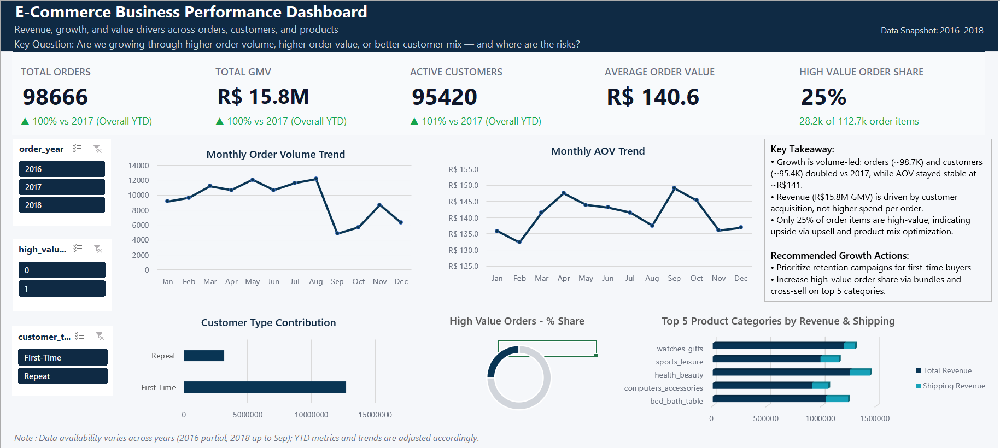
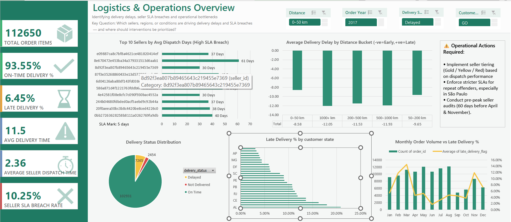
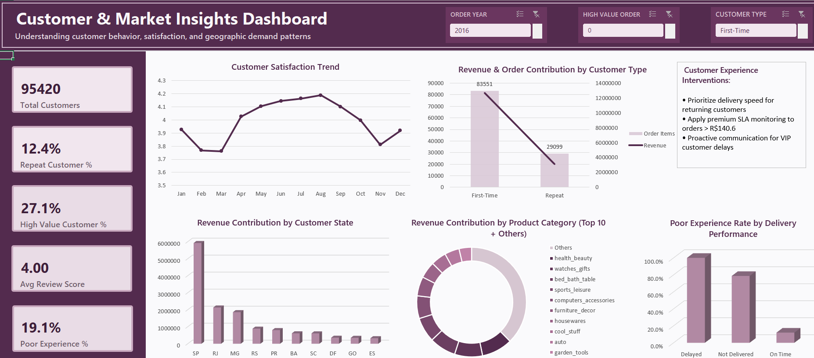

# 📊 E-Commerce Operations & Retention Optimization Analysis

## 🔍 Overview
This project is a deep-dive analysis of a Brazilian e-commerce marketplace dataset (Olist) to understand a critical business problem: **low customer retention**.

Despite generating significant revenue, the platform was struggling to convert first-time buyers into repeat customers.

Using **Excel, Power Query, and Data Modeling**, I transformed 9+ raw relational tables into a structured dataset and uncovered a key insight:

> 🚨 **87% of customers never returned after their first purchase.**

---

## 🎯 Problem Statement

The business showed strong top-line performance:

- 💰 **Total GMV:** R$15.8M  
- 📦 **100,000+ orders processed**

However, a deeper look revealed a structural issue:

> Growth was driven by **new customers**, not **repeat customers**

### Key Questions:
- Why are customers not returning?
- Is this a marketing problem or an operational problem?
- What factors influence customer satisfaction and retention?

---

## 📂 Dataset Source

- 📊 **Olist E-Commerce Dataset (Kaggle)** - 
- Includes:
  - Orders
  - OrderItems
  - Customers
  - Sellers
  - Reviews
  - Products
  - Geolocation

⚠️ **Note:**  
Due to file size limitations, raw datasets and working files are not uploaded to this repository.

However:
- Dataset source is linked above  
- Full analysis process is documented here  
- Visual outputs are included via screenshots  

---

## 🛠️ Tools & Techniques

- **Excel**
- **Power Query (ETL)**
- **Data Modeling (Relational Structure)**
- **DAX (Calculated Metrics)**
- **PivotTables & Dashboards**

---

## 🧠 Analysis Framework

To ensure accuracy and scalability, I followed a structured 5-step workflow:

### 1. Define the Grain
- Established **one row per order item**
- Prevented ambiguity before joins

---

### 2. Sanitize at Source
- Cleaned and transformed individual tables before merging
- Examples:
  - Aggregated reviews at `order_id` level  
  - Removed duplicate geolocation entries  

---

### 3. Validate Every Join
- Performed **row-count audits after each merge**
- Prevented:
  - Data duplication  
  - Inflated revenue  
  - Incorrect metrics  

---

### 4. Feature Engineering (Decision Metrics)

Created meaningful business metrics:

- **SLA Breach Flag** → Did delivery exceed estimated date?  
- **Delivery Duration** → Purchase → Delivery timeline  
- **Sentiment Buckets** → Positive / Neutral / Negative reviews  

---

### 5. Stakeholder-Focused Visualization

Designed dashboards for different business functions:

- 📊 Executive (Strategy)
- ⚙️ Operations (Logistics)
- 💬 Customer Experience

---

## 🔗 Core Insight (Causal Chain)
Seller Dispatch Delay → SLA Breach → Poor Reviews → Customer Drop-off

---

## 📈 Key Findings

### 1. Seller Dispatch Bottleneck

- 📉 **10.25% SLA breach rate**
- 🚚 Sellers took **30–61 days** to dispatch orders
- ❌ Shipping distance was NOT the main issue

👉 Root problem: **Seller-side inefficiency**

---

### 2. Delivery Delays Impact Customer Experience

- ⭐ Delayed orders had **~100% higher poor review rates**
- 📉 Direct impact on trust and satisfaction

👉 Insight:
> Every delay is not just operational—it’s a **retention killer**

---

### 3. The “Leaky Bucket” Problem

- 🔴 **87% of customers = one-time buyers**
- 🟢 Only ~13% returned

Repeat customers:
- Spent more (higher AOV)
- Gave better reviews

👉 Business was:
> Good at acquisition ❌  
> Bad at retention ❌  

---

## 📊 Dashboard & Analysis

### Executive Overview

---

### Operations & Seller Performance

---

### Customer Experience Insights

---

## 📉 Business Impact Potential

| Metric | Current | Estimated Improvement |
|--------|--------|----------------------|
| SLA Breach Rate | 10.25% | ~6–7% |
| Poor Experience Rate | 19.1% | ~11–13% |
| Repeat Customer Rate | 12.4% | ~14–15% |

---

## 🚀 Strategic Recommendations

### 1. Seller Tiering System (Highest Impact)
- Classify sellers: **Gold / Red**
- Penalize high dispatch delays  
- Incentivize fast fulfillment  

---

### 2. Retention Triggers
- Offer discounts ONLY after successful delivery  
- Reinforce positive first experience  

---

### 3. High-Value Order Protection
- Focus on top **25% high-value orders (>R$140)**  
- Apply proactive monitoring  

---

## ⚠️ Critical Learning

### Initial Hypothesis:
- Geography (distance) was causing delays  

### Reality:
- Weak correlation between distance and delay  
- Strong correlation with **seller dispatch time**

> 💡 **Lesson:**  
> Good analysis is not about proving your assumptions—  
> it’s about following the data, even when it contradicts you.

---

## 📌 Project Limitations

- Raw datasets not included due to size constraints  
- Analysis performed in Excel (scalability can be improved using SQL/Python in future iterations)

---

## 📝 Full Case Study

👉 Read the complete breakdown here:  
**https://medium.com/@amulyapriyaeamani441/87-of-customers-never-returned-an-e-commerce-case-study-part-1-5143b8ba0225**

---

## 📂 Project & Connect

- 🔗 **GitHub:** This repository
- 📂 **Excel File:** https://1drv.ms/x/c/65b85ec81694cb41/IQD868NdrZnSSp1zYvXtggBvASIvcVFfZ5Tif6wbkni7eM8?e=xzGXbF 
- 💼 **LinkedIn:** https://www.linkedin.com/in/amulyapriyaeamani/

---

## 💼 Open to Opportunities

I’m currently looking for **entry-level Data Analyst / Business Analyst roles**.

I focus on:
- Structured problem-solving  
- Business-driven analysis  
- Turning messy data into actionable insights  

If you're hiring or building a data-driven team, feel free to connect.

---

## 💬 Let’s Discuss

What’s a business problem you uncovered from data that looked “normal” at first—but wasn’t?
